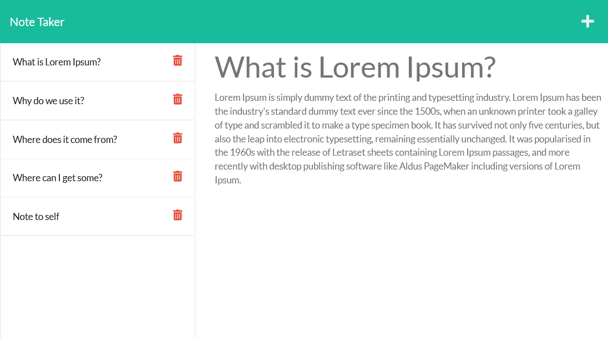

# Super Note Taker Deluxe 3000

## Table of Contents

- [Description](#description)
- [Usage](#usage)
- [Credits](#credits)
- [License](#license)

## Description
Super Note Taker Deluxe 3000 is an application written in JavaScript using the **node.js** runtime. This application uses an **Express.js** back end and will save and retrieve note data from a JSON file. 

Here's a preview of the application:
 

## Usage
After you visit the [Super Note Taker Deluxe 3000](https://super-note-taker-deluxe-3000.herokuapp.com) website and hit the landing page click **Get Started**. You'll be presented with a 2-panel interface. On the left-hand side is a list of notes. On the right hand side you'll see the new note area. Here you can add a new note by providing a title and some text for the note body. Notice that a save button appears after you do this. Hit save and the note will appear on the left side bar along with the others. You can browse through the notes by click on each of them in the side bar. If you want to add a new note simply click the plus button in the top right corner and you'll be presented with the note composer again. You can also delete notes by clicking the trash can icon next to each note in the left side bar.

## Credits
I used a function I found on StackOverflow called [`stringTemplateParser`](https://stackoverflow.com/a/56920019/9367208) to assist me with the status messages I was trying to return in my JSON responses.

## License
This application is covered under the [MIT License](https://choosealicense.com/licenses/mit/).

